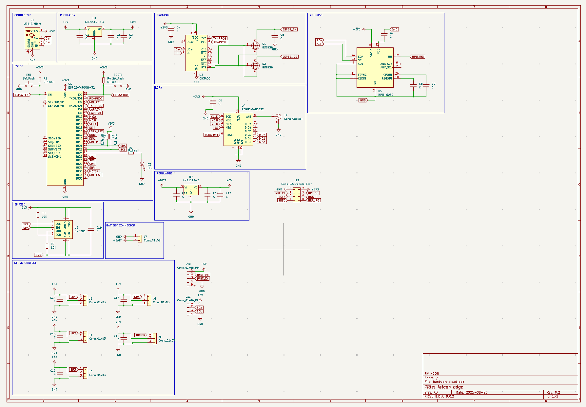

# FALCON-EDGE — An Open-Source Flying-Wing with an ESP32 Flight Computer

Falcon-Edge is a compact flying-wing airframe with a custom **ESP32-based flight computer**.  
This repo contains the **KiCad hardware project** and **3D CAD** needed to print, assemble, and fly your own Falcon-Edge.

---

## Highlights

- **Airframe**

  - 3D-printable center pod with **top and bottom service hatches** for fast access.
  - Designed for clean airflow over the pod; embedded antenna keep-out zone.
  - Uses off-the-shelf wing cores/foam or your own prints.

- **Avionics (KiCad)**
  - **ESP32-WROOM** module as the main controller (Wi-Fi/BLE for ground testing & logs).
  - **IMU:** MPU-6050 6-axis.
  - **Baro:** BMP280.
  - **GNSS header** for a u-blox NEO-style GPS module.
  - **Power:** AMS1117 regulators (3V3/5V) and dedicated servo power planes/decoupling.
  - **Programming:** UART header with EN/BOOT auto-reset circuitry.
  - **RF/Telemetry:** LoRa with edge SMA/U.FL footprint for an external antenna (radio/telemetry module of your choice).

> See the schematic for exact pin mapping and connector naming.

---

## 📂 Repository Layout

hardware/ # KiCad project (.kicad_pro, .kicad_pcb, .kicad_sch, etc.)
cad/ # 3D parts for the center pod, hatches, and mounting (STLs/STEP)
images/ # Renders and board views used in this README (optional)

(If you keep everything at the repo root, this README references the images there by filename.)

---

## 🛠️ Getting Started

### 1) Hardware (KiCad)

- Open with **KiCad 8.x** or newer.
- Files:
  - `hardware.kicad_pro` – project
  - `hardware.kicad_sch` – schematic
  - `hardware.kicad_pcb` – PCB layout
- Generate Gerbers/BoM as usual and order from your preferred fab.

**Board preview**

**Schematic overview**

### 2) Print & Fit the Pod

- Recommended: **PETG** or **ABS** for the pod & hatches (heat-tolerant in the sun).
- Use heat-set **M3 inserts** for the hatch screws and board standoffs.
- Verify antenna **keep-out** in the pod before final mounting.

**Top hatch opening**

**Bottom hatch opening**

### 3) Wiring (at a glance)

- **Battery in** → power/battery header near regulators.
- **Servos** → servo headers (driven by PCA9685 over I²C).
- **GPS** → dedicated UART header / GPS footprint.
- **Programming** → UART (EN/BOOT accessible).
- **Telemetry/Radio** → SMA/U.FL at the board edge.

> Exact connector names/positions: see the KiCad schematic & silkscreen.

---

## 📸 Gallery

**3D view of the board**

**Airframe with pod & hatches**

---

## 📏 Design Notes & Decisions

- **ESP32** was chosen for its strong dev-tooling and built-in wireless (great for bench testing/logging).
- **I²C sensor stack** (MPU-6050 + BMP280) keeps routing simple and expandable.
- **PCA9685** provides plenty of PWM channels beyond the two elevons (landing gear, camera gimbal, accessories).
- **Serviceability first:** both hatches allow quick access to battery, connectors, and the main board.

---

## 🗺️ Roadmap

- Flight firmware & mixer (stabilization, RTL, waypointing).
- Airspeed/Pitot and magnetometer options.
- On-board logging (SPI flash / SD).
- CAN/Telemetry radio module footprints.
- STL release of wing cores/center pod variants.

---

## 🤝 Contributing

PRs and issues are welcome:

- Hardware changes: update the KiCad files and include board screenshots.
- CAD tweaks: include STEP/STL and a short note on print settings.
- Please attach images when reporting fit or routing problems.

---

## 📜 License

Choose the license(s) that fit your goals and add a `LICENSE` file. A common split is:

- **CERN-OHL-W v2** for hardware,
- **CC BY-SA 4.0** for CAD models,
- **Apache-2.0** for firmware.

---

## 🙏 Credits

Designed and built by **RMINGON**.
